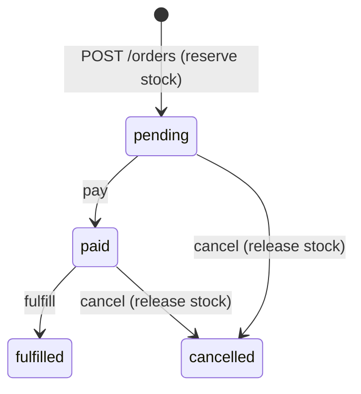

# FastAPI Distributed Orders

An **advanced** sample for order processing across services: async SQLAlchemy, JWT auth, **idempotent** creates, a **transactional outbox**, inventory reservation, and **optimistic locking** on status changes.

The code is one monolith, but the boundaries mirror how you would split workers and APIs in production.

Interactive docs: [Swagger UI](/docs) and [ReDoc](/redoc).

## Patterns

| Pattern | Where it shows up |
|---------|-------------------|
| Idempotency | `Idempotency-Key` on `POST /api/v1/orders` → `idempotency_records` |
| Outbox | Same DB transaction writes `orders` + `outbox_events` |
| Correlation | `X-Request-ID` → `order.correlation_id` (via request context) |
| Inventory | Conditional `UPDATE` decrements `products.stock_quantity` |
| Optimistic lock | `expected_version` on pay / fulfill / cancel → **409** on drift |

## What you get

| Area | Behavior |
|------|----------|
| Auth | Register, login, refresh, logout, `GET /api/v1/auth/me` |
| Products | Public catalog; admin creates SKUs |
| Orders | Idempotent create, list (own vs admin), versioned transitions |
| Outbox | Admin lists unpublished events; `POST .../publish` acks delivery |
| Ops | Request id middleware, readiness probe, structured logs |

## Order lifecycle



Each transition appends an outbox event (`order.paid`, `order.fulfilled`, `order.cancelled`).

## Project layout

```
app/
  main.py                 # OpenAPI narrative for advanced readers
  middleware/             # X-Request-ID
  db/                     # engine, bootstrap, seed data
  models/                 # users, products, orders, outbox, idempotency
  api/deps.py             # JWT, Idempotency-Key, admin guard
  services/order_service.py   # core distributed rules
tests/                    # idempotency, lifecycle, outbox, 404 privacy
```

## Setup

```bash
python -m venv .venv
source .venv/bin/activate
pip install -e ".[dev]"
cp .env.example .env
alembic upgrade head
python -c "import asyncio; from app.db.seed import seed_reference_data; ..."
```

Tests call `create_all` + `seed_reference_data` automatically.

For local dev after migrate, seed once:

```bash
uvicorn app.main:app --reload
```

Sign in as **`admin@example.com`** / **`AdminPass123!`**. Catalog SKUs: **`WIDGET-1`**, **`GADGET-2`**.

## Example flow

```bash
# 1) Token
TOKEN=$(curl -s -X POST http://127.0.0.1:8000/api/v1/auth/login \
  -H 'Content-Type: application/json' \
  -d '{"email":"admin@example.com","password":"AdminPass123!"}' | jq -r .access_token)

# 2) Idempotent order
curl -s -X POST http://127.0.0.1:8000/api/v1/orders \
  -H "Authorization: Bearer $TOKEN" \
  -H 'Idempotency-Key: demo-2026-001' \
  -H 'X-Request-ID: checkout-trace-1' \
  -H 'Content-Type: application/json' \
  -d '{"items":[{"sku":"WIDGET-1","quantity":2}]}'

# 3) Pay (use version from response)
curl -s -X POST http://127.0.0.1:8000/api/v1/orders/1/pay \
  -H "Authorization: Bearer $TOKEN" \
  -H 'Content-Type: application/json' \
  -d '{"expected_version":1}'

# 4) Inspect outbox (admin)
curl -s http://127.0.0.1:8000/api/v1/outbox?unpublished_only=true \
  -H "Authorization: Bearer $TOKEN"
```

## Where the rules live

| Rule | Location |
|------|----------|
| Idempotency replay | `OrderService.create_order` |
| Stock reservation | `ProductRepository.reserve` / `release` |
| Version checks | `OrderService._check_version` |
| Outbox append | `OrderService` on create and transitions |
| Admin-only outbox | `OutboxService` + `require_admin` |

## Tests

```bash
pytest -v
ruff check app tests
```

## Docker

```bash
docker compose up --build
```

Uses Postgres; `scripts/start.sh` runs migrations before uvicorn.
