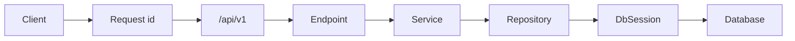

# Advanced starter

Copy this folder when you start an advanced FastAPI service. It is the shared layout, not a product. There is no sample domain. Health probes are the only routes, so you can see the app boot before you add your own.

Local runs use a SQLite file so you do not need Docker on day one. `docker compose` switches the same code to Postgres.

## What is already wired

| Piece | Where | What it does |
|-------|--------|----------------|
| Settings | `app/core/config.py` | Reads `.env`. Cached with `get_settings` |
| Errors | `app/core/exceptions.py` | `AppError` becomes `{"detail": "..."}` |
| Logs | `app/core/logging.py` | Each line includes the request id |
| Request id | `app/middleware/request_context.py` | Reads or mints `X-Request-ID` and returns it |
| Database | `app/db/session.py` | Async SQLAlchemy engine, created in the lifespan |
| Models | `app/models/base.py` | Declarative base. Add tables beside it |
| Migrations | `alembic/` | `alembic upgrade head` on container start |
| Probes | `GET /api/v1/health/live` and `/ready` | Live skips the database. Ready runs `SELECT 1` |
| Session dependency | `app/api/deps.py` | `DbSession` for repositories |

`schemas/`, `repositories/`, and `services/` are empty on purpose. That is where each new project puts its features.

## Layout

```
app/
  main.py                     # factory, lifespan, CORS, exception handlers
  core/                       # settings, logging, AppError
  middleware/                 # request id
  db/session.py               # async engine
  models/                     # SQLAlchemy models (import them in models/__init__.py)
  schemas/                    # Pydantic models
  repositories/               # queries
  services/                   # business rules
  api/deps.py                 # DbSession
  api/v1/endpoints/           # HTTP routes
  api/v1/router.py            # include each endpoint module here
alembic/                      # migrations
scripts/start.sh              # migrate, then uvicorn
tests/api/v1/                 # API tests (in-memory SQLite)
```

### Request path



Routes stay thin. Services raise `NotFoundError`, `ConflictError`, `ForbiddenError`, or `UnauthorizedError`. Repositories only talk to the session.

## Copy this into a new project

From the repository root:

```bash
cp -R advanced/starter advanced/your-service
cd advanced/your-service
rm -rf .venv .pytest_cache starter.db
```

Then rename the service in three places:

1. `pyproject.toml` — `name` and `description`
2. `.env.example` — `APP_NAME` and, if you use Compose, the Postgres database name in `docker-compose.yml`
3. `app/core/config.py` — default `app_name`

Do not copy a virtualenv or a local `starter.db`.

## Add a feature

Use one name all the way down, for example `orders`:

1. `app/models/order.py` — SQLAlchemy model subclassing `Base`
2. Import that module in `app/models/__init__.py` so Alembic sees the table
3. `app/schemas/order.py` — request and response models
4. `app/repositories/order_repository.py` — queries, taking `AsyncSession`
5. `app/services/order_service.py` — rules, raising `AppError` subclasses
6. `app/api/v1/endpoints/orders.py` — routes, depending on `DbSession`
7. `api_router.include_router(...)` in `app/api/v1/router.py`
8. `tests/api/v1/test_orders.py`

Generate the migration after the model import is in place:

```bash
alembic revision --autogenerate -m "add orders"
alembic upgrade head
```

## Setup

```bash
python -m venv .venv
source .venv/bin/activate   # Windows: .venv\Scripts\activate
pip install -e ".[dev]"
cp .env.example .env
```

## Run locally

SQLite is the default (`./starter.db`):

```bash
alembic upgrade head
uvicorn app.main:app --reload
```

| URL | Purpose |
|-----|---------|
| http://127.0.0.1:8000 | Welcome |
| http://127.0.0.1:8000/docs | Swagger UI |
| http://127.0.0.1:8000/redoc | ReDoc |
| http://127.0.0.1:8000/api/v1/health/live | Process is up |
| http://127.0.0.1:8000/api/v1/health/ready | Database accepts `SELECT 1` |

```bash
curl -s http://127.0.0.1:8000/api/v1/health/live
curl -sD - http://127.0.0.1:8000/api/v1/health/ready -o /dev/null
```

The response includes `x-request-id`. Send your own with `-H "X-Request-ID: trace-123"` and the same value comes back. Other log lines for that call use it too. Probe paths are not written at info level.

Readiness returns `503` and `{"status":"unavailable","database":"error"}` when the database cannot be reached.

## Run with Postgres

```bash
cp .env.example .env
docker compose up --build
```

Compose sets `DATABASE_URL` to `postgresql+asyncpg://starter:starter@db:5432/starter` and starts the API only after Postgres is healthy. The container runs `alembic upgrade head` before uvicorn.

## Tests and lint

Tests force an in-memory SQLite URL, so they do not need Postgres or your `.env` database.

```bash
pytest -v
ruff check app tests alembic
```

## What this template leaves to the project

Authentication, background jobs, and WebSockets are not included. Add them in the service that needs them, in the same layers: dependency in `api/deps.py`, rules in `services/`, HTTP in `endpoints/`.
