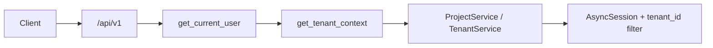

# FastAPI Multitenant SaaS

An **advanced** FastAPI sample: async SQLAlchemy, Alembic migrations, JWT auth with refresh rotation, and **tenant isolation** via `X-Tenant-Slug`. Users are global; workspaces (tenants) own **projects** and **memberships** with roles.

The lesson is not “add a `tenant_id` column” alone — it is how **identity** (JWT) and **context** (header) combine in dependencies, and how services enforce **roles** and **plan limits**.

Interactive docs: [Swagger UI](/docs) and [ReDoc](/redoc).

## What you get

| Area | Behavior |
|------|----------|
| Auth | Register (user + tenant + owner), login, refresh, logout |
| Tenants | List memberships, create another tenant, read/update current workspace |
| Members | Invite existing users by email, list, remove (owner/admin rules) |
| Projects | CRUD scoped to active tenant; free plan capped at 3 projects |
| Data | Postgres in Docker; SQLite file locally; in-memory SQLite in tests |
| Ops | Liveness/readiness probes, structured request id middleware |

## Two headers on tenant routes

| Header | Purpose |
|--------|---------|
| `Authorization: Bearer <access>` | Who is calling (global user id in JWT) |
| `X-Tenant-Slug: acme-corp` | Which tenant row every query filters on |

Missing slug → **403**. Unknown slug → **404**. Not a member → **403**.

## Roles

| Role | Tenant update | Invite/remove members | Projects |
|------|---------------|----------------------|----------|
| `owner` | Yes | Yes (cannot remove last owner) | Create/read/update; delete needs admin+ |
| `admin` | Yes | Yes (cannot remove owner) | Same |
| `member` | No | No | Create/read/update; delete → **409** |

## Project layout

```
app/
  main.py                 # OpenAPI narrative for advanced readers
  core/                   # Settings, JWT + bcrypt, AppError types
  db/                     # Async engine factory, test bootstrap
  models/                 # SQLAlchemy: tenants, users, memberships, projects
  api/deps.py             # get_current_user, get_tenant_context
  api/v1/endpoints/       # auth, users, tenants, projects, health
  repositories/           # Async SQLAlchemy queries
  services/               # Register transaction, RBAC, plan limits
alembic/versions/         # Initial multitenant schema
tests/                    # Auth, tenant header, isolation, plan limit
```

### Request flow



## Setup

```bash
python -m venv .venv
source .venv/bin/activate
pip install -e ".[dev]"
cp .env.example .env
alembic upgrade head
uvicorn app.main:app --reload
```

Docker Compose (Postgres):

```bash
docker compose up --build
```

## Walkthrough (curl)

Register and capture tokens + slug:

```bash
curl -s -X POST http://127.0.0.1:8000/api/v1/auth/register \
  -H 'Content-Type: application/json' \
  -d '{
    "email": "owner@acme.example",
    "password": "SecurePass123!",
    "full_name": "Alex Owner",
    "tenant_name": "Acme Corp",
    "tenant_slug": "acme-corp"
  }'
```

Create a project (both headers):

```bash
export TOKEN="<access_token from register>"
curl -s -X POST http://127.0.0.1:8000/api/v1/projects \
  -H "Authorization: Bearer $TOKEN" \
  -H 'X-Tenant-Slug: acme-corp' \
  -H 'Content-Type: application/json' \
  -d '{"name": "Roadmap", "description": "Q4 deliverables"}'
```

Invite a colleague (they must already have registered globally):

```bash
curl -s -X POST http://127.0.0.1:8000/api/v1/tenants/current/members \
  -H "Authorization: Bearer $TOKEN" \
  -H 'X-Tenant-Slug: acme-corp' \
  -H 'Content-Type: application/json' \
  -d '{"email": "member@example.com", "role": "member"}'
```

## Where the rules live

| Rule | Location |
|------|----------|
| JWT validation | `app/core/security.py`, `app/api/deps.py` |
| Tenant membership | `get_tenant_context` in `app/api/deps.py` |
| Owner on register | `AuthService.register` (single DB transaction) |
| Member invite / remove | `TenantService` |
| Free plan project cap | `ProjectService.create_project` + `Settings.free_plan_project_limit` |
| Row isolation | Repositories always filter by `tenant_id` |

## Tests

```bash
pytest
ruff check .
```

Tests create schema with `create_all` (no Alembic in CI) and exercise register → tenant header → project limit.

## Configuration

See `.env.example` for `SECRET_KEY`, JWT lifetimes, and `DATABASE_URL`. Change `SECRET_KEY` in every non-local environment.
