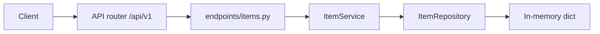

# FastAPI Hello API

A beginner-friendly FastAPI service with versioned routes, Pydantic schemas, repository/service layers, health checks, and interactive OpenAPI docs. Items are stored in an in-memory mock database (data resets when the process restarts).

## What you get

| Feature | Details |
|---------|---------|
| Root welcome | `GET /` — short JSON pointer to `/docs` |
| Health | `GET /api/v1/health` — liveness for probes and monitoring |
| Items CRUD | Full create, read, update, delete on `/api/v1/items` |
| Validation | Request bodies validated with Pydantic (name length, non-negative price) |
| Errors | Domain errors return JSON `{"detail": "..."}` with appropriate HTTP status |
| CORS | Configurable origins (defaults allow local frontends on port 3000) |
| Tests | Pytest coverage for list, create, 404, and health |

## Project layout

```
app/
  main.py                 # App factory, CORS, exception handlers
  core/                   # Settings (pydantic-settings), AppError
  api/v1/endpoints/       # HTTP route handlers
  schemas/                # Pydantic request/response models
  repositories/           # In-memory item store
  services/               # Business logic
tests/
  api/v1/                 # API integration tests
```

### Request flow (end to end)



1. **HTTP** — FastAPI matches the path and parses the body into `ItemCreate` / `ItemUpdate`.
2. **Dependencies** — `get_item_service` injects a shared `ItemService` (and repository) per request.
3. **Service** — Validates business rules and maps missing items to 404 via `AppError`.
4. **Repository** — Reads/writes the in-memory catalog (seed data: three widgets).

## Setup

From this directory:

```bash
python -m venv .venv
source .venv/bin/activate   # Windows: .venv\Scripts\activate
pip install -e ".[dev]"
```

Optional environment file:

```bash
cp .env.example .env
```

See `.env.example` for `APP_NAME`, `DEBUG`, `API_V1_PREFIX`, and `CORS_ORIGINS`.

## Run the server

```bash
uvicorn app.main:app --reload
```

| URL | Purpose |
|-----|---------|
| http://127.0.0.1:8000 | API root |
| http://127.0.0.1:8000/docs | Swagger UI (try endpoints in the browser) |
| http://127.0.0.1:8000/redoc | ReDoc |

## End-to-end walkthrough

With the server running, the following exercises the full item lifecycle using `curl`. Responses are JSON; status codes match REST conventions.

**1. Welcome and health**

```bash
curl -s http://127.0.0.1:8000/
curl -s http://127.0.0.1:8000/api/v1/health
```

Expected health body: `{"status":"ok"}`.

**2. List seed items**

```bash
curl -s http://127.0.0.1:8000/api/v1/items
```

You should see three items (`Widget A`, `Widget B`, `Widget C`).

**3. Get one item**

```bash
curl -s http://127.0.0.1:8000/api/v1/items/1
```

**4. Create an item**

```bash
curl -s -X POST http://127.0.0.1:8000/api/v1/items \
  -H "Content-Type: application/json" \
  -d '{"name": "Gadget X", "price": 12.5, "in_stock": true}'
```

Returns `201` with the new `id` (typically `4` on a fresh server).

**5. Partial update (PATCH)**

```bash
curl -s -X PATCH http://127.0.0.1:8000/api/v1/items/4 \
  -H "Content-Type: application/json" \
  -d '{"price": 11.0, "in_stock": false}'
```

Only sent fields change; omitted fields stay as they were.

**6. Full replace (PUT)**

```bash
curl -s -X PUT http://127.0.0.1:8000/api/v1/items/4 \
  -H "Content-Type: application/json" \
  -d '{"name": "Gadget X Pro", "price": 15.0, "in_stock": true}'
```

**7. Delete**

```bash
curl -s -X DELETE http://127.0.0.1:8000/api/v1/items/4
```

Response includes `deleted: true` and the removed item snapshot.

**8. Not found**

```bash
curl -s -o /dev/null -w "%{http_code}\n" http://127.0.0.1:8000/api/v1/items/999
```

Expect `404` with `{"detail":"Item 999 not found"}`.

### Same flow in Swagger UI

Open http://127.0.0.1:8000/docs, expand **items**, and run **POST /api/v1/items** then **GET /api/v1/items** — no `curl` required.

### Automated end-to-end check

Tests hit the app via FastAPI’s `TestClient` (no running server needed):

```bash
pytest -v
```

This verifies listing seed data, creating an item, 404 behavior, and the health endpoint.

## API reference

| Method | Path | Description |
|--------|------|-------------|
| GET | `/` | Welcome message |
| GET | `/api/v1/health` | Health check |
| GET | `/api/v1/items` | List all items |
| GET | `/api/v1/items/{id}` | Get item by id |
| POST | `/api/v1/items` | Create item |
| PUT | `/api/v1/items/{id}` | Replace item (full body) |
| PATCH | `/api/v1/items/{id}` | Partial update |
| DELETE | `/api/v1/items/{id}` | Delete item |

### Item JSON shape

**Create / replace body**

```json
{
  "name": "string (1–100 chars)",
  "price": 0.0,
  "in_stock": true
}
```

**Read response** — same fields plus `"id": 1`.

**Patch body** — any subset of `name`, `price`, `in_stock`.

## Lint

```bash
ruff check app tests
```

## Docker

Build and run the same API in a container:

```bash
docker build -t fastapi-hello-api .
docker run --rm -p 8000:8000 fastapi-hello-api
```

Then use the [end-to-end walkthrough](#end-to-end-walkthrough) against `http://127.0.0.1:8000`.


