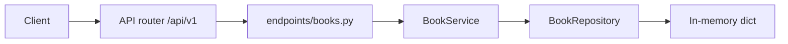

# FastAPI Book Catalog

A beginner-friendly library catalog. Routes live under `/api/v1`. Each request goes through an endpoint, a service, and an in-memory repository. Data resets when the process restarts.

## What you get

| Feature | Details |
|---------|---------|
| Root welcome | `GET /` — short JSON pointer to `/docs` |
| Health | `GET /api/v1/health` — liveness for probes |
| Books | Create, read, update, feature, unfeature, and delete on `/api/v1/books` |
| Genres | `GET /api/v1/books/genres` — distinct genre labels |
| Filters | `genre`, `search`, `available`, and `featured` on the list |
| Validation | Title/author length, optional year range, ISBN length via Pydantic |
| Uniqueness | Duplicate ISBNs return **409** (hyphens ignored when comparing) |
| Errors | Missing books return `{"detail": "Book {id} not found"}` with status 404 |
| Docs | Swagger UI at `/docs` and ReDoc at `/redoc`, with request examples |
| Tests | Pytest coverage for seed data, search, ISBN rules, feature, delete, and genres |

## Project layout

```
app/
  main.py                 # App factory, CORS, exception handlers, OpenAPI text
  core/                   # Settings (pydantic-settings), AppError types
  api/v1/endpoints/       # HTTP route handlers
  schemas/                # Pydantic request/response models
  repositories/           # In-memory book store
  services/               # ISBN uniqueness and 404 mapping
tests/
  api/v1/                 # API integration tests
```

### Request flow



1. **HTTP** — FastAPI matches the path and parses the body into `BookCreate` or `BookUpdate`.
2. **Dependencies** — `get_book_service` injects one shared `BookService` and repository.
3. **Service** — Enforces unique ISBN and maps a missing id to `NotFoundError`.
4. **Repository** — Reads and writes the in-memory catalog. Three books are seeded.

## Rules

| Field | Rule |
|-------|------|
| `title` | Required. 1–200 characters after leading and trailing spaces are removed. |
| `author` | Required. 1–120 characters after trim. |
| `isbn` | Optional. Unique when set. Comparison ignores hyphens and spaces. |
| `genre` | Defaults to `General`. At most 60 characters. |
| `publication_year` | Optional integer from 1000 through 2100. |
| `available` | Defaults to `true`. Use `available=false` when all copies are checked out. |
| `featured` | Defaults to `false`. Featured titles sort to the top of the list. |
| id | Integers starting at 1. The next id after the seed data is 4. |

Marking a book featured again, or unfeaturing a non-featured title, returns the same book.

A `PATCH` with an empty body `{}` changes nothing. Send `"isbn": ""` to clear an ISBN.

`search` matches `title`, `author`, or normalized `isbn` and ignores case. `genre` is an exact match (case insensitive). You can combine query parameters. A blank `search` or `genre` is ignored.

Inside the featured group and inside the non-featured group, smaller ids come first.

## Setup

From this directory:

```bash
python -m venv .venv
source .venv/bin/activate   # Windows: .venv\Scripts\activate
pip install -e ".[dev]"
```

Optional environment file:

```bash
cp .env.example .env
```

See `.env.example` for `APP_NAME`, `DEBUG`, `API_V1_PREFIX`, and `CORS_ORIGINS`.

## Run the server

```bash
uvicorn app.main:app --reload
```

| URL | Purpose |
|-----|---------|
| http://127.0.0.1:8000 | API root |
| http://127.0.0.1:8000/docs | Swagger UI (try endpoints in the browser) |
| http://127.0.0.1:8000/redoc | ReDoc |

## End-to-end walkthrough

With the server running:

**1. Welcome and health**

```bash
curl -s http://127.0.0.1:8000/
curl -s http://127.0.0.1:8000/api/v1/health
```

**2. List seed books (featured first)**

```bash
curl -s http://127.0.0.1:8000/api/v1/books
curl -s http://127.0.0.1:8000/api/v1/books/genres
```

**3. Filter software titles**

```bash
curl -s 'http://127.0.0.1:8000/api/v1/books?genre=Software'
```

**4. Add a book**

```bash
curl -s -X POST http://127.0.0.1:8000/api/v1/books \
  -H "Content-Type: application/json" \
  -d '{
    "title": "Designing Data-Intensive Applications",
    "author": "Martin Kleppmann",
    "isbn": "978-1449373320",
    "genre": "Software",
    "publication_year": 2017
  }'
```

**5. Mark checked out**

```bash
curl -s -X PATCH http://127.0.0.1:8000/api/v1/books/4 \
  -H "Content-Type: application/json" \
  -d '{"available": false}'
```

**6. Feature a title**

```bash
curl -s -X POST http://127.0.0.1:8000/api/v1/books/2/feature
```

**7. Delete**

```bash
curl -s -X DELETE http://127.0.0.1:8000/api/v1/books/4
```

Open http://127.0.0.1:8000/docs and expand **books** to run the same flow without `curl`.

## API reference

| Method | Path | Description |
|--------|------|-------------|
| GET | `/` | Welcome message |
| GET | `/api/v1/health` | Health check |
| GET | `/api/v1/books/genres` | Distinct genres |
| GET | `/api/v1/books` | List books (query filters) |
| GET | `/api/v1/books/{id}` | Get one book |
| POST | `/api/v1/books` | Create book |
| PUT | `/api/v1/books/{id}` | Replace book |
| PATCH | `/api/v1/books/{id}` | Partial update |
| POST | `/api/v1/books/{id}/feature` | Mark featured |
| POST | `/api/v1/books/{id}/unfeature` | Clear featured |
| DELETE | `/api/v1/books/{id}` | Delete book |

## Where the rules live

| Rule | Location |
|------|----------|
| Request validation | `app/schemas/book.py` |
| ISBN uniqueness | `BookService` + `BookRepository.isbn_taken` |
| List ordering and filters | `BookRepository.list_books` |
| HTTP status mapping | `AppError` handler in `app/main.py` |

## Tests and lint

```bash
pytest -v
ruff check app tests
```

## Docker

```bash
docker build -t fastapi-book-catalog .
docker run --rm -p 8000:8000 fastapi-book-catalog
```
