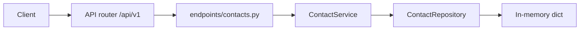

# FastAPI Contact Book

A beginner-friendly contact list. Routes are versioned under `/api/v1`. Each request goes through an endpoint, a service, and an in-memory repository. Data resets when the process restarts.

## What you get

| Feature | Details |
|---------|---------|
| Root welcome | `GET /` — short JSON pointer to `/docs` |
| Health | `GET /api/v1/health` — liveness for probes |
| Contacts | Create, read, update, favorite, unfavorite, and delete on `/api/v1/contacts` |
| Filters | `favorite` and `search` query parameters on the list |
| Validation | Name length, optional email format, string length limits via Pydantic |
| Uniqueness | Duplicate emails return **409** (case insensitive) |
| Errors | Missing contacts return `{"detail": "Contact {id} not found"}` with status 404 |
| Docs | Swagger UI at `/docs` and ReDoc at `/redoc`, with request examples |
| Tests | Pytest coverage for seed data, search, email rules, favorite, delete, and 422 |

## Project layout

```
app/
  main.py                 # App factory, CORS, exception handlers, OpenAPI text
  core/                   # Settings (pydantic-settings), AppError
  api/v1/endpoints/       # HTTP route handlers
  schemas/                # Pydantic request/response models
  repositories/           # In-memory contact store
  services/               # Duplicate email checks and 404 mapping
tests/
  api/v1/                 # API integration tests
```

### Request flow



1. **HTTP** — FastAPI matches the path and parses the body into `ContactCreate` or `ContactUpdate`.
2. **Dependencies** — `get_contact_service` injects one shared `ContactService` and repository.
3. **Service** — Enforces unique email and maps a missing id to `NotFoundError`.
4. **Repository** — Reads and writes the in-memory list. Three contacts are seeded.

## Rules

| Field | Rule |
|-------|------|
| `full_name` | Required. 1–120 characters after leading and trailing spaces are removed. |
| `email` | Optional. Must be a valid address when set. Unique in the book, ignoring case. |
| `phone` | Optional. At most 32 characters. Spaces are trimmed. |
| `company` | Optional. At most 120 characters. |
| `notes` | Optional. At most 500 characters. |
| `favorite` | Defaults to `false`. Favorites are listed first. |
| id | Integers starting at 1. The next id after the seed data is 4. |

Marking a favorite again, or unfavoriting a non-favorite, returns the same contact.

A `PATCH` with an empty body `{}` changes nothing. Send `"email": ""` to remove an email address.

`search` matches `full_name`, `email`, `phone`, `company`, or `notes` and ignores case. `favorite=true` keeps favorites only. You can send both. A blank `search` is ignored.

Inside the favorite group and inside the non-favorite group, smaller ids come first.

## Setup

From this directory:

```bash
python -m venv .venv
source .venv/bin/activate   # Windows: .venv\Scripts\activate
pip install -e ".[dev]"
```

Optional environment file:

```bash
cp .env.example .env
```

See `.env.example` for `APP_NAME`, `DEBUG`, `API_V1_PREFIX`, and `CORS_ORIGINS`.

## Run the server

```bash
uvicorn app.main:app --reload
```

| URL | Purpose |
|-----|---------|
| http://127.0.0.1:8000 | API root |
| http://127.0.0.1:8000/docs | Swagger UI (try endpoints in the browser) |
| http://127.0.0.1:8000/redoc | ReDoc |

## End-to-end walkthrough

**1. Welcome and health**

```bash
curl -s http://127.0.0.1:8000/
curl -s http://127.0.0.1:8000/api/v1/health
```

Expected health body: `{"status":"ok"}`.

**2. List the seed contacts**

```bash
curl -s http://127.0.0.1:8000/api/v1/contacts
```

| id | full_name | email | favorite |
|----|-----------|-------|----------|
| 1 | Ada Lovelace | ada@example.com | true |
| 2 | Grace Hopper | grace@example.com | false |
| 3 | Lin Phone-only | (none) | false |

**3. Filter and search**

```bash
curl -s "http://127.0.0.1:8000/api/v1/contacts?favorite=true"
curl -s "http://127.0.0.1:8000/api/v1/contacts?search=compilers"
curl -s "http://127.0.0.1:8000/api/v1/contacts?search=555-0199"
```

**4. Create**

```bash
curl -s -X POST http://127.0.0.1:8000/api/v1/contacts \
  -H "Content-Type: application/json" \
  -d '{"full_name":"Sam Rivera","email":"sam@example.com","phone":"+1-555-0142"}'
```

Returns `201`. On a fresh server the new id is `4`. Reusing `sam@example.com` or `SAM@example.com` returns **409**.

**5. Partial update**

```bash
curl -s -X PATCH http://127.0.0.1:8000/api/v1/contacts/4 \
  -H "Content-Type: application/json" \
  -d '{"company":"Rivera Design"}'
```

**6. Favorite and unfavorite**

```bash
curl -s -X POST http://127.0.0.1:8000/api/v1/contacts/4/favorite
curl -s -X POST http://127.0.0.1:8000/api/v1/contacts/4/unfavorite
```

**7. Delete**

```bash
curl -s -X DELETE http://127.0.0.1:8000/api/v1/contacts/4
```

The body includes `deleted: true` and a snapshot of the removed contact.

**8. Not found**

```bash
curl -s -o /dev/null -w "%{http_code}\n" http://127.0.0.1:8000/api/v1/contacts/999
```

Expect `404` with `{"detail":"Contact 999 not found"}`.

### Same flow in Swagger UI

Open http://127.0.0.1:8000/docs, expand **contacts**, and run **POST /api/v1/contacts** using the “Contact with email” example, then **GET /api/v1/contacts**.

### Automated check

```bash
pytest -v
ruff check app tests
```

## API reference

| Method | Path | Description |
|--------|------|-------------|
| GET | `/` | Welcome message |
| GET | `/api/v1/health` | Health check |
| GET | `/api/v1/contacts` | List contacts. Optional `favorite` and `search` |
| GET | `/api/v1/contacts/{id}` | Get one contact |
| POST | `/api/v1/contacts` | Create a contact (`201`) |
| PATCH | `/api/v1/contacts/{id}` | Change only the fields you send |
| POST | `/api/v1/contacts/{id}/favorite` | Set `favorite` to true |
| POST | `/api/v1/contacts/{id}/unfavorite` | Set `favorite` to false |
| DELETE | `/api/v1/contacts/{id}` | Delete and return a snapshot |

### Create body

```json
{
  "full_name": "Sam Rivera",
  "email": "sam@example.com",
  "phone": "+1-555-0142",
  "company": "Rivera Design",
  "notes": "Met at the meetup.",
  "favorite": false
}
```

Omit `email` for phone-only entries.

### Read response

```json
{
  "id": 1,
  "full_name": "Ada Lovelace",
  "email": "ada@example.com",
  "phone": "+1-555-0101",
  "company": "Analytical Engines Ltd",
  "notes": "Ask about the notes API pattern.",
  "favorite": true
}
```

### Patch body

Any subset of `full_name`, `email`, `phone`, `company`, `notes`, and `favorite`. Use `"email": ""` to clear the email.

## Docker

```bash
docker build -t fastapi-contact-book .
docker run --rm -p 8000:8000 fastapi-contact-book
```

Then use the walkthrough against `http://127.0.0.1:8000`.
