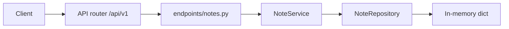

# FastAPI Notes

A beginner-friendly notes list. Routes are versioned under `/api/v1`. Each request goes through an endpoint, a service, and an in-memory repository. Data resets when the process restarts.

## What you get

| Feature | Details |
|---------|---------|
| Root welcome | `GET /` — short JSON pointer to `/docs` |
| Health | `GET /api/v1/health` — liveness for probes |
| Notes | Create, read, update, pin, unpin, and delete on `/api/v1/notes` |
| Filters | `pinned` and `search` query parameters on the list |
| Validation | Title length and body length via Pydantic |
| Errors | Missing notes return `{"detail": "Note {id} not found"}` with status 404 |
| Docs | Swagger UI at `/docs` and ReDoc at `/redoc`, with request examples |
| Tests | Pytest coverage for seed data, search, create, patch, pin, delete, and 422 |

## Project layout

```
app/
  main.py                 # App factory, CORS, exception handlers, OpenAPI text
  core/                   # Settings (pydantic-settings), AppError
  api/v1/endpoints/       # HTTP route handlers
  schemas/                # Pydantic request/response models
  repositories/           # In-memory note store
  services/               # Looks up missing notes and raises 404
tests/
  api/v1/                 # API integration tests
```

### Request flow



1. **HTTP** — FastAPI matches the path and parses the body into `NoteCreate` or `NoteUpdate`.
2. **Dependencies** — `get_note_service` injects one shared `NoteService` and repository.
3. **Service** — Maps a missing id to `NotFoundError`, which the app turns into JSON.
4. **Repository** — Reads and writes the in-memory list. Three notes are seeded.

## Rules

| Field | Rule |
|-------|------|
| `title` | Required. 1–120 characters after leading and trailing spaces are removed. |
| `body` | Optional. At most 2000 characters. Spaces are trimmed. Blank is allowed. |
| `pinned` | Defaults to `false`. Pinned notes are listed first. |
| id | Integers starting at 1. The next id after the seed data is 4. |

Pinning a note that is already pinned, or unpinning one that is already unpinned, returns the same note.

A `PATCH` with an empty body `{}` changes nothing and returns the current note. Fields you omit stay as they were.

`search` matches the title or the body and ignores case. `pinned=true` keeps pinned notes. You can send both. A blank `search` is ignored.

Inside the pinned group and inside the unpinned group, smaller ids come first.

## Setup

From this directory:

```bash
python -m venv .venv
source .venv/bin/activate   # Windows: .venv\Scripts\activate
pip install -e ".[dev]"
```

Optional environment file:

```bash
cp .env.example .env
```

See `.env.example` for `APP_NAME`, `DEBUG`, `API_V1_PREFIX`, and `CORS_ORIGINS`.

## Run the server

```bash
uvicorn app.main:app --reload
```

| URL | Purpose |
|-----|---------|
| http://127.0.0.1:8000 | API root |
| http://127.0.0.1:8000/docs | Swagger UI (try endpoints in the browser) |
| http://127.0.0.1:8000/redoc | ReDoc |

## End-to-end walkthrough

**1. Welcome and health**

```bash
curl -s http://127.0.0.1:8000/
curl -s http://127.0.0.1:8000/api/v1/health
```

Expected health body: `{"status":"ok"}`.

**2. List the seed notes**

```bash
curl -s http://127.0.0.1:8000/api/v1/notes
```

| id | title | pinned |
|----|-------|--------|
| 1 | Meeting notes | true |
| 2 | Grocery list | false |
| 3 | FastAPI reading | false |

**3. Filter and search**

```bash
curl -s "http://127.0.0.1:8000/api/v1/notes?pinned=false"
curl -s "http://127.0.0.1:8000/api/v1/notes?search=milk"
```

`search=milk` returns the grocery list. `search=API` matches both "Meeting notes" and "FastAPI reading" because the match ignores case and looks at the body too.

**4. Create**

```bash
curl -s -X POST http://127.0.0.1:8000/api/v1/notes \
  -H "Content-Type: application/json" \
  -d '{"title": "Ideas for the walkthrough", "body": "Show search, then pin."}'
```

Returns `201`. On a fresh server the new id is `4` and pinned is `false`.

**5. Partial update**

```bash
curl -s -X PATCH http://127.0.0.1:8000/api/v1/notes/4 \
  -H "Content-Type: application/json" \
  -d '{"body": "Show search, pin, and delete."}'
```

**6. Pin and unpin**

```bash
curl -s -X POST http://127.0.0.1:8000/api/v1/notes/4/pin
curl -s -X POST http://127.0.0.1:8000/api/v1/notes/4/unpin
```

After pin, note 4 is listed with the other pinned notes, ahead of the unpinned ones.

**7. Delete**

```bash
curl -s -X DELETE http://127.0.0.1:8000/api/v1/notes/4
```

The body includes `deleted: true` and a snapshot of the removed note.

**8. Not found**

```bash
curl -s -o /dev/null -w "%{http_code}\n" http://127.0.0.1:8000/api/v1/notes/999
```

Expect `404` with `{"detail":"Note 999 not found"}`.

### Same flow in Swagger UI

Open http://127.0.0.1:8000/docs, expand **notes**, and run **POST /api/v1/notes** using the “A note that starts pinned” example, then **GET /api/v1/notes**.

### Automated check

```bash
pytest -v
ruff check app tests
```

## API reference

| Method | Path | Description |
|--------|------|-------------|
| GET | `/` | Welcome message |
| GET | `/api/v1/health` | Health check |
| GET | `/api/v1/notes` | List notes. Optional `pinned` and `search` |
| GET | `/api/v1/notes/{id}` | Get one note |
| POST | `/api/v1/notes` | Create a note (`201`) |
| PATCH | `/api/v1/notes/{id}` | Change only the fields you send |
| POST | `/api/v1/notes/{id}/pin` | Set `pinned` to true |
| POST | `/api/v1/notes/{id}/unpin` | Set `pinned` to false |
| DELETE | `/api/v1/notes/{id}` | Delete and return a snapshot |

### Create body

```json
{
  "title": "string, 1–120 characters",
  "body": "optional, up to 2000 characters",
  "pinned": false
}
```

### Read response

```json
{
  "id": 1,
  "title": "Meeting notes",
  "body": "Discuss the API layout.",
  "pinned": true
}
```

### Patch body

Any subset of `title`, `body`, and `pinned`.

## Docker

```bash
docker build -t fastapi-notes .
docker run --rm -p 8000:8000 fastapi-notes
```

Then use the walkthrough against `http://127.0.0.1:8000`.
