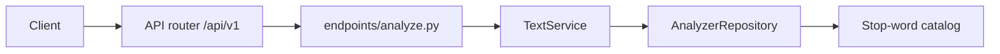

# FastAPI Text Analyzer

A beginner-friendly FastAPI service that measures plain text and applies a few transforms. Counts, the stop-word list, and reading speed live in a static catalog (nothing is stored between requests).

Interactive documentation is served by the app itself: Swagger UI at `/docs` and ReDoc at `/redoc`. The OpenAPI description states the counting rules, and **POST /api/v1/analyze** and **POST /api/v1/transform** include ready-to-run examples.

## What you get

| Feature | Details |
|---------|---------|
| Root welcome | `GET /` — short JSON pointer to `/docs` |
| Health | `GET /api/v1/health` — liveness for probes and monitoring |
| Options lookup | `GET /api/v1/options` — limits, modes, and stop words |
| Analyze | `POST /api/v1/analyze` — counts, reading time, palindrome, top words |
| Transform | `POST /api/v1/transform` — `lower`, `upper`, `title`, `reverse`, `slug` |
| Validation | Text cannot be blank or longer than 10,000 characters |
| Errors | Invalid bodies return JSON `{"detail": ...}` with HTTP 422 |
| CORS | Configurable origins (defaults allow local frontends on port 3000) |
| Tests | Pytest coverage for counts, palindromes, transforms, and the OpenAPI document |

## Project layout

```
app/
  main.py                 # App factory, OpenAPI text, CORS, exception handlers
  core/                   # Settings, limits, AppError
  api/v1/endpoints/       # HTTP route handlers (health, options, analyze, transform)
  schemas/                # Pydantic request/response models
  repositories/           # Stop-word catalog
  services/               # Counting and transform rules
tests/
  api/v1/                 # API integration tests
```

### Request flow (end to end)



1. **HTTP** — FastAPI matches the path and parses the body into `AnalyzeRequest` or `TransformRequest`.
2. **Dependencies** — `get_text_service` injects a shared `TextService` and the stop-word catalog.
3. **Service** — Tokenizes the text, applies the requested rule, and builds the response.
4. **Repository** — Read-only list of English function words used only for `top_words`.

## Setup

From this directory:

```bash
python -m venv .venv
source .venv/bin/activate   # Windows: .venv\Scripts\activate
pip install -e ".[dev]"
```

Optional environment file:

```bash
cp .env.example .env
```

See `.env.example` for `APP_NAME`, `DEBUG`, `API_V1_PREFIX`, and `CORS_ORIGINS`.

## Run the server

```bash
uvicorn app.main:app --reload
```

| URL | Purpose |
|-----|---------|
| http://127.0.0.1:8000 | API root |
| http://127.0.0.1:8000/docs | Swagger UI (try endpoints in the browser) |
| http://127.0.0.1:8000/redoc | ReDoc |
| http://127.0.0.1:8000/openapi.json | Raw OpenAPI schema |

If port 8000 is already in use, start with `--port 8001` and point the examples at that port.

## End-to-end walkthrough

With the server running, the following exercises lookup, analysis, and transforms with `curl`. Responses are JSON.

**1. Welcome and health**

```bash
curl -s http://127.0.0.1:8000/
curl -s http://127.0.0.1:8000/api/v1/health
```

Expected health body: `{"status":"ok"}`.

**2. List options**

```bash
curl -s http://127.0.0.1:8000/api/v1/options
```

You should see `reading_words_per_minute` of `200`, `max_text_length` of `10000`, five transform modes, and a sorted stop-word list that includes `the`.

**3. Analyze a short greeting**

```bash
curl -s -X POST http://127.0.0.1:8000/api/v1/analyze \
  -H "Content-Type: application/json" \
  -d '{"text": "Hello, world! Hello."}'
```

```json
{
  "characters": 20,
  "characters_no_spaces": 18,
  "words": 3,
  "unique_words": 2,
  "sentences": 2,
  "paragraphs": 1,
  "average_word_length": 5.0,
  "reading_time_seconds": 1,
  "is_palindrome": false,
  "top_words": [
    {"word": "hello", "count": 2},
    {"word": "world", "count": 1}
  ]
}
```

`top_n` defaults to 5. Ties break alphabetically.

**4. Palindrome**

```bash
curl -s -X POST http://127.0.0.1:8000/api/v1/analyze \
  -H "Content-Type: application/json" \
  -d '{"text": "A man, a plan, a canal: Panama"}'
```

`is_palindrome` is `true`. Spaces, commas, and the colon are ignored, and case does not matter.

**5. Skip stop words in the ranking**

```bash
curl -s -X POST http://127.0.0.1:8000/api/v1/analyze \
  -H "Content-Type: application/json" \
  -d '{"text": "The cat and the dog", "ignore_stop_words": true}'
```

`words` is still `5` (every token counts). `top_words` is only `cat` and `dog`.

**6. Transform**

```bash
curl -s -X POST http://127.0.0.1:8000/api/v1/transform \
  -H "Content-Type: application/json" \
  -d '{"text": "Hello, World!", "mode": "slug"}'
```

`result` is `hello-world`. `mode` is case-insensitive (`SLUG` works).

**7. Rejected text**

```bash
curl -s -o /dev/null -w "%{http_code}\n" \
  -X POST http://127.0.0.1:8000/api/v1/analyze \
  -H "Content-Type: application/json" \
  -d '{"text": "   "}'
```

Expect `422`. The same status is returned for an unknown transform mode or text longer than 10,000 characters.

### Same flow in Swagger UI

Open http://127.0.0.1:8000/docs, expand **analyze**, choose the **Repeated greeting** example, and execute. Expand **options** and run **GET /api/v1/options** to see the stop words that example relies on.

### Automated end-to-end check

Tests hit the app via FastAPI’s `TestClient` (no running server needed):

```bash
pytest -v
```

This verifies the greeting counts, the Panama palindrome, stop-word ranking, slug/title/reverse, blank input, and the OpenAPI document.

## API reference

| Method | Path | Description |
|--------|------|-------------|
| GET | `/` | Welcome message |
| GET | `/api/v1/health` | Health check |
| GET | `/api/v1/options` | Limits, modes, reading speed, stop words |
| POST | `/api/v1/analyze` | Statistics for one text |
| POST | `/api/v1/transform` | Rewrite text with one mode |

### Analyze request

```json
{
  "text": "Hello, world! Hello.",
  "top_n": 5,
  "ignore_stop_words": false
}
```

`text` must contain a non-whitespace character and be at most 10,000 characters. Spaces at the ends are kept, so they count as characters. `top_n` is from 1 to 50.

### Analyze response

| Field | Meaning |
|-------|---------|
| `characters` | `len(text)`, including spaces and punctuation |
| `characters_no_spaces` | Characters that are not whitespace |
| `words` | ASCII word tokens, case-insensitive |
| `unique_words` | Distinct tokens. Stop words are still included. |
| `sentences` | Pieces that contain a word after splitting on `.`, `!`, and `?` |
| `paragraphs` | Blocks separated by a blank line |
| `average_word_length` | Mean token length, half-up to 2 decimal places. `0` when there are no words. |
| `reading_time_seconds` | `words / 200 * 60`, half-up to a whole second. One word rounds to `0`. |
| `is_palindrome` | Letters and digits only, lowercased, same forward and backward |
| `top_words` | `{word, count}` ranked by count, then alphabetically. Honor `ignore_stop_words`. |

### Transform request

```json
{
  "text": "Hello, World!",
  "mode": "slug"
}
```

| Mode | Result for a typical input |
|------|----------------------------|
| `lower` | `hello, world!` |
| `upper` | `HELLO, WORLD!` |
| `title` | `Hello, World!` — each word capitalized, punctuation left in place. `don't stop` becomes `Don't Stop`. |
| `reverse` | Characters reversed, including spaces (`ab c` → `c ba`) |
| `slug` | Lowercase, non-letters become single hyphens (`Hello, World!` → `hello-world`). `!!!` becomes `""`. |

### Error catalog

| Situation | Status |
|-----------|--------|
| Blank or whitespace-only text | 422 |
| Text longer than 10,000 characters | 422 |
| `top_n` outside 1–50 | 422 |
| Unknown `mode` | 422 |

## How analysis works

**Words.** A token matches letters or digits, plus one apostrophe group: `don't` is one word, `Hello,` is `hello`. Matching is ASCII, so `café` is not treated as a single word. Counts lowercase the token; `Hello` and `hello` are the same word.

**Sentences.** The text is split on one or more `.`, `!`, or `?`. A piece counts only when it still contains a word, so `!!!` has zero sentences. `Dr. Smith is here.` counts as two sentences because the period after `Dr` is a break.

**Paragraphs.** Line endings are normalized, then the text is split on a blank line. `First.\n\nSecond.` is two paragraphs.

**Palindrome.** Strip everything that is not a letter or digit, lowercase, and compare with the reverse. `A man, a plan, a canal: Panama` becomes `amanaplanacanalpanama`.

**Reading time.** 200 words take 60 seconds. The value is rounded half-up, so two words (`0.6` seconds) become `1`, and one word (`0.3` seconds) stays `0`.

**Stop words.** A short fixed list of English function words (`the`, `and`, `of`, …). They change `top_words` only when `ignore_stop_words` is true. `words` and `unique_words` always include them. Call `GET /api/v1/options` for the full list.

## Lint

```bash
ruff check app tests
```

## Docker

Build and run the same API in a container:

```bash
docker build -t fastapi-text-analyzer .
docker run --rm -p 8000:8000 fastapi-text-analyzer
```

Then use the [end-to-end walkthrough](#end-to-end-walkthrough) against `http://127.0.0.1:8000`.
