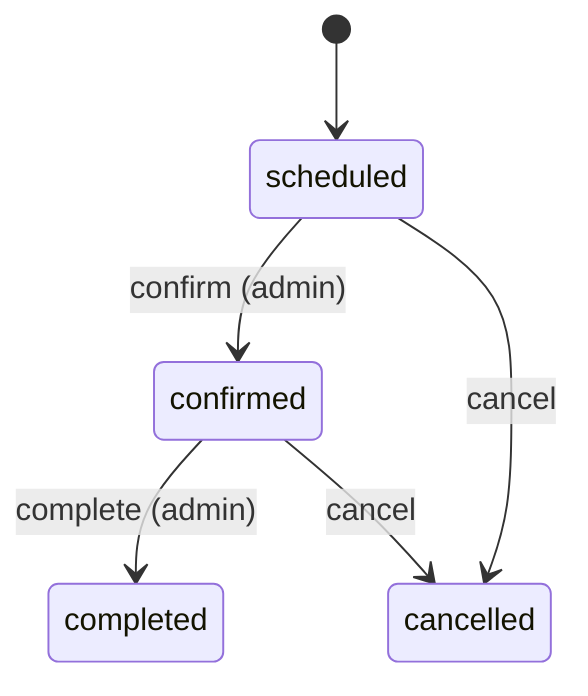
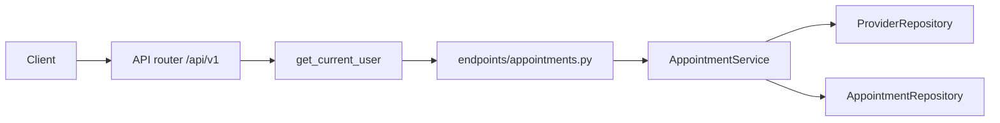

# FastAPI Appointments

An intermediate FastAPI service: JWT login, a provider roster, client bookings, and a small visit status workflow. Users, refresh tokens, providers, and appointments live in memory and reset when the process restarts.

The interesting part is where rules live. Dependencies prove **who you are**. `AppointmentService` checks overlap, ownership, and which status move is legal.

Interactive docs: [Swagger UI](/docs) and [ReDoc](/redoc). **POST /api/v1/appointments** includes a booking example.

## What you get

| Area | Behavior |
|------|----------|
| Auth | Register, login, refresh rotation, logout, `GET /api/v1/auth/me` |
| Providers | List active clinicians. Admin creates, updates, deactivates |
| Booking | Clients book for themselves. Duration 15 minutes to 8 hours |
| Overlap | Same provider cannot double-book non-cancelled windows |
| Status | `scheduled` → `confirmed` → `completed`, or cancel from scheduled/confirmed |
| Visibility | Another user's appointment id returns **404**, not **403** |
| Errors | Domain failures return `{"detail": "..."}` with 401, 403, 404, or 409 |
| Docs | Swagger and ReDoc, plus this walkthrough |

## Roles

| | Client (`user`) | Platform admin |
|--|-----------------|----------------|
| List providers | Active only | Can include inactive |
| Book | Yes, for self | Yes |
| List appointments | Own rows only | All rows; filter by `user_id` |
| Reschedule (`PATCH`) | Own, while `scheduled` | Same |
| Cancel | Own, while `scheduled` or `confirmed` | Any |
| Confirm / complete | No (`403`) | Yes |

## Status



Edit (`PATCH`) is allowed only in `scheduled`. Each transition has its own route so `/docs` shows the legal move.

## Project layout

```
app/
  main.py                 # App factory, OpenAPI text, CORS, AppError handler
  core/                   # Settings, JWT + bcrypt, AppError types
  api/deps.py             # Bearer token, repository providers
  api/v1/endpoints/       # auth, users, providers, appointments, health
  schemas/                # Pydantic models for providers and appointments
  repositories/           # In-memory providers and appointments
  services/               # Auth rules and appointment rules
tests/
  api/v1/                 # Auth, providers, booking, overlap, status
```

### Request flow



## Setup

```bash
python -m venv .venv
source .venv/bin/activate
pip install -e ".[dev]"
cp .env.example .env
```

## Run

```bash
uvicorn app.main:app --reload
```

| URL | Purpose |
|-----|---------|
| http://127.0.0.1:8000/docs | Swagger UI |
| http://127.0.0.1:8000/api/v1/health | Liveness |

Seed admin: `admin@example.com` / `AdminPass123!`. Providers id **1** (Dr Ada Lovelace) and **2** (Dr Grace Hopper).

## Walkthrough

**1. Log in**

```bash
curl -s -X POST http://127.0.0.1:8000/api/v1/auth/login \
  -d "username=admin@example.com&password=AdminPass123!"
```

**2. List providers**

```bash
curl -s http://127.0.0.1:8000/api/v1/providers \
  -H "Authorization: Bearer <access_token>"
```

**3. Book**

```bash
curl -s -X POST http://127.0.0.1:8000/api/v1/appointments \
  -H "Authorization: Bearer <access_token>" \
  -H "Content-Type: application/json" \
  -d '{
    "provider_id": 1,
    "title": "Annual checkup",
    "starts_at": "2026-12-10T10:00:00+00:00",
    "ends_at": "2026-12-10T10:30:00+00:00"
  }'
```

**4. Confirm and complete (admin)**

```bash
curl -s -X POST http://127.0.0.1:8000/api/v1/appointments/<id>/confirm \
  -H "Authorization: Bearer <admin_access_token>"

curl -s -X POST http://127.0.0.1:8000/api/v1/appointments/<id>/complete \
  -H "Authorization: Bearer <admin_access_token>"
```

**5. Cancel (client or admin)**

```bash
curl -s -X POST http://127.0.0.1:8000/api/v1/appointments/<id>/cancel \
  -H "Authorization: Bearer <access_token>"
```

Cancelled slots no longer block overlap for that provider.

## API reference

| Method | Path | Who | Description |
|--------|------|-----|-------------|
| GET | `/api/v1/providers` | Bearer | List providers. Query: `include_inactive` (admin) |
| POST | `/api/v1/providers` | Admin | Add a provider |
| GET | `/api/v1/providers/{id}` | Bearer | One provider |
| PATCH | `/api/v1/providers/{id}` | Admin | Update name or specialty |
| POST | `/api/v1/providers/{id}/deactivate` | Admin | Stop new bookings |
| POST | `/api/v1/providers/{id}/activate` | Admin | Allow bookings again |
| GET | `/api/v1/appointments` | Bearer | List. Query: `status`, `provider_id`, `user_id`, `from_time`, `to_time` |
| POST | `/api/v1/appointments` | Bearer | Book |
| GET | `/api/v1/appointments/{id}` | Bearer | One appointment |
| PATCH | `/api/v1/appointments/{id}` | Client or admin | Reschedule while `scheduled` |
| POST | `/api/v1/appointments/{id}/confirm` | Admin | `scheduled` → `confirmed` |
| POST | `/api/v1/appointments/{id}/complete` | Admin | `confirmed` → `completed` |
| POST | `/api/v1/appointments/{id}/cancel` | Client or admin | → `cancelled` |

Auth and user routes match the other intermediate projects (`/api/v1/auth/*`, `/api/v1/users/*`).

## Where the rules live

| Rule | Code |
|------|------|
| Token required | `app/api/deps.py` — `get_current_user` |
| Overlap | `AppointmentService._assert_no_overlap` |
| Hidden appointment | `AppointmentService._visible_appointment` |
| Status graph | `_TRANSITIONS` in `appointment_service.py` |
| Inactive provider | `_active_provider`, deactivate on roster |

## Tests and lint

```bash
pytest -v
ruff check app tests
```

## Docker

```bash
docker build -t fastapi-appointments .
docker run --rm -p 8000:8000 -e SECRET_KEY=your-production-secret fastapi-appointments
```
