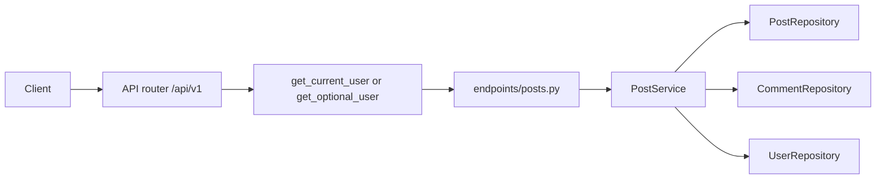
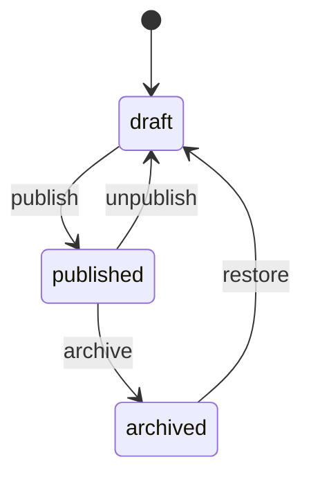

# FastAPI Blog

An intermediate FastAPI service: JWT login, a public reading list, and a small publishing workflow. Users, refresh tokens, posts, and comments live in memory and reset when the process restarts.

The interesting part is visibility. A published post is public. A draft is not a secret 403 — to everyone except the author and a platform admin, it is a **404**, the same response as a slug that was never created. Those checks live in `PostService`, not in the route that happens to call them.

Interactive docs: [Swagger UI](/docs) and [ReDoc](/redoc). The OpenAPI page states the status rules. **POST /api/v1/posts** and **POST /api/v1/posts/{slug}/comments** include request examples.

## What you get

| Area | Behavior |
|------|----------|
| Auth | Register, login, refresh rotation, logout, `GET /api/v1/auth/me` |
| Public list | Published posts only, with tag, author, and text filters plus limit/offset |
| Drafts | Author and platform admin can open them by slug. Everyone else gets 404 |
| Publishing | `draft` → `published` → `archived`, and back to `draft` on the legal edges |
| Comments | Signed-in users comment on published posts. Drafts return 409 to people who can see them |
| Tags | Public counts of tags that appear on published posts |
| Errors | Domain failures return `{"detail": "..."}` with 401, 403, 404, or 409 |
| Docs | Swagger and ReDoc, plus this walkthrough |

## Three answers, on purpose

| Status | When you get it | Example |
|--------|-----------------|---------|
| 401 | No usable token on a route that needs one, or a **bad** token on a public read | Missing bearer on `POST /posts`, garbage bearer on `GET /posts/{slug}` |
| 403 | You can see the resource, and the action is not yours | Stranger edits a published post. Admin tries to publish your draft |
| 404 | The slug is unknown, **or** the post is hidden from you | Anonymous `GET` of a draft |
| 409 | The post exists, you may act, and a rule still fails | Duplicate slug, comment on your own draft, archive a draft |
| 422 | The body or query has the wrong shape | Tag with a space, title that cannot become a slug |

A missing `Authorization` header on `GET /api/v1/posts/{slug}` means anonymous. Sending `Bearer not-a-token` is 401. Invalid credentials are not treated as "no credentials."

`GET /api/v1/posts/mine` is the authenticated catalog. It returns your drafts, published posts, and archives. A platform admin does **not** see other people's drafts there. Admin opens those by slug.

## Project layout

```
app/
  main.py                 # App factory, OpenAPI text, CORS, AppError handler
  core/                   # Settings, JWT + bcrypt, AppError types
  api/deps.py             # Bearer token, optional user, repository providers
  api/v1/endpoints/       # auth, users, posts, comments, tags, health
  schemas/                # Pydantic models, slug and tag shape
  repositories/           # In-memory users, refresh tokens, posts, comments
  services/               # Auth rules, post rules, comment rules
tests/
  api/v1/                 # Auth flow, publishing, comments
```

### Request flow



1. **HTTP** — FastAPI parses the body, query, and the `slug` in the path.
2. **Auth dependency** — `get_current_user` requires an access token. `get_optional_user` allows a missing header and still rejects a bad token.
3. **Service** — Decides whether this caller can see the post, then applies the author, admin, and status rules.
4. **Repositories** — Read and write the in-memory stores. They do not decide permissions.

## Post status



New posts are always `draft`. Each arrow is its own route, so the legal move is visible in `/docs`.

| Route | Who | Effect |
|-------|-----|--------|
| `POST .../publish` | Author | `draft` → `published`. Sets `published_at` |
| `POST .../unpublish` | Author | `published` → `draft`. Clears `published_at` |
| `POST .../archive` | Author or admin | `published` → `archived`. Keeps `published_at` |
| `POST .../restore` | Author | `archived` → `draft`. Clears `published_at` |

A draft cannot jump straight to `archived`. Repeating the current status is `409`, not a silent no-op. Read `_TRANSITIONS` in `app/services/post_service.py`.

The slug is chosen at create time, from the title or from the `slug` field. It does not change when you rename the post. Titles with no letters or digits (or non-ASCII titles) need an explicit slug; otherwise create returns 422.

## Setup

From this directory:

```bash
python -m venv .venv
source .venv/bin/activate   # Windows: .venv\Scripts\activate
pip install -e ".[dev]"
cp .env.example .env        # set SECRET_KEY outside local use
```

## Run

```bash
uvicorn app.main:app --reload
```

| URL | Purpose |
|-----|---------|
| http://127.0.0.1:8000 | API root |
| http://127.0.0.1:8000/docs | Swagger UI |
| http://127.0.0.1:8000/redoc | ReDoc |
| http://127.0.0.1:8000/openapi.json | Raw OpenAPI schema |

If port 8000 is taken, start with `--port 8001`.

The process starts with one admin, one published post, one draft, and one comment:

| | Value |
|--|--------|
| Admin | `admin@example.com` / `AdminPass123!` |
| Published | slug `writing-apis-that-teach`, tags `fastapi` and `docs`, one comment |
| Draft | slug `draft-pagination-notes`, tag `pagination`. Public `GET` returns 404 |

## End-to-end walkthrough

**1. Health and the public list**

```bash
curl -s http://127.0.0.1:8000/api/v1/health
curl -s http://127.0.0.1:8000/api/v1/posts
curl -s http://127.0.0.1:8000/api/v1/posts/writing-apis-that-teach
curl -s -o /dev/null -w "%{http_code}\n" \
  http://127.0.0.1:8000/api/v1/posts/draft-pagination-notes
```

The last command prints `404`. The draft is real. You are not allowed to know that without a token that can see it.

**2. Register and log in**

Login uses a form body. The field is `username`, and the value is the email.

```bash
curl -s -X POST http://127.0.0.1:8000/api/v1/auth/register \
  -H "Content-Type: application/json" \
  -d '{"email":"you@example.com","password":"SecurePass1!","full_name":"You"}'

curl -s -X POST http://127.0.0.1:8000/api/v1/auth/login \
  -d "username=you@example.com&password=SecurePass1!"
```

Save `access_token`. Send it as `Authorization: Bearer <access_token>` on create, edit, publish, and comment calls.

**3. Create a draft and read it back**

```bash
curl -s -X POST http://127.0.0.1:8000/api/v1/posts \
  -H "Authorization: Bearer <access_token>" \
  -H "Content-Type: application/json" \
  -d '{"title":"Hello, World!","summary":"First post","body":"Drafts stay off the public list.","tags":["fastapi"]}'
```

The slug is `hello-world`. `GET /api/v1/posts` does not include it. This does:

```bash
curl -s http://127.0.0.1:8000/api/v1/posts/hello-world \
  -H "Authorization: Bearer <access_token>"
```

Creating `Hello, World!` again returns `409` because the derived slug is already taken. Send `"slug": "hello-again"` to keep the same title.

**4. Publish, then comment**

```bash
curl -s -X POST http://127.0.0.1:8000/api/v1/posts/hello-world/publish \
  -H "Authorization: Bearer <access_token>"

curl -s -X POST http://127.0.0.1:8000/api/v1/posts/hello-world/comments \
  -H "Authorization: Bearer <access_token>" \
  -H "Content-Type: application/json" \
  -d '{"body":"Published posts accept comments."}'
```

Commenting before publish returns `409` with `Only published posts accept comments`.

**5. Filter the public list**

```bash
curl -s "http://127.0.0.1:8000/api/v1/posts?tag=fastapi&q=drafts&limit=10&offset=0"
curl -s http://127.0.0.1:8000/api/v1/tags
```

`tag`, `author_id`, and `q` combine with AND. `q` searches title, summary, and body, ignoring case. `total` is the match count before `limit` and `offset`. Tag `pagination` is missing from `/api/v1/tags` until that draft is published.

**6. Open the seed draft as admin**

```bash
curl -s -X POST http://127.0.0.1:8000/api/v1/auth/login \
  -d "username=admin@example.com&password=AdminPass123!"

curl -s http://127.0.0.1:8000/api/v1/posts/draft-pagination-notes \
  -H "Authorization: Bearer <admin_access_token>"
```

Admin can archive or delete a published post they did not write. Admin cannot `PATCH` the body and cannot publish someone else's draft. Both of those stay with the author.

### Same flow in Swagger UI

Open http://127.0.0.1:8000/docs. **GET /api/v1/posts/{slug}** can be called with no token. Use **Authorize** with an access token from **POST /api/v1/auth/login** (the password form) before **POST /api/v1/posts**. Run the **Draft, slug taken from the title** example.

### Tests

```bash
pytest -v
```

Auth tests cover register, refresh rotation, logout, and the admin user list. Post tests cover the public list, slug rules, the status path, and author versus admin. Comment tests cover the published-only rule and who may delete.

## API reference

| Method | Path | Who | Description |
|--------|------|-----|-------------|
| GET | `/` | — | Welcome |
| GET | `/api/v1/health` | — | Liveness |
| POST | `/api/v1/auth/register` | — | Create account |
| POST | `/api/v1/auth/login` | — | Form login, returns token pair |
| POST | `/api/v1/auth/refresh` | — | Rotate refresh token |
| POST | `/api/v1/auth/logout` | — | Revoke refresh token |
| GET | `/api/v1/auth/me` | Bearer | Current account |
| GET | `/api/v1/users` | Platform admin | List accounts |
| GET | `/api/v1/users/{id}` | Self or admin | One account |
| GET | `/api/v1/posts` | — | Published posts. Query: `tag`, `author_id`, `q`, `limit`, `offset` |
| GET | `/api/v1/posts/mine` | Bearer | Your posts, any status. Query: `status`, `limit`, `offset` |
| POST | `/api/v1/posts` | Bearer | Create a draft |
| GET | `/api/v1/posts/{slug}` | Public, or bearer to preview | One post. Hidden posts are 404 |
| PATCH | `/api/v1/posts/{slug}` | Author | Edit title, summary, body, tags. Slug stays |
| POST | `/api/v1/posts/{slug}/publish` | Author | `draft` → `published` |
| POST | `/api/v1/posts/{slug}/unpublish` | Author | `published` → `draft` |
| POST | `/api/v1/posts/{slug}/archive` | Author or admin | `published` → `archived` |
| POST | `/api/v1/posts/{slug}/restore` | Author | `archived` → `draft` |
| DELETE | `/api/v1/posts/{slug}` | Author or admin | Delete the post and its comments (`204`) |
| GET | `/api/v1/posts/{slug}/comments` | Same visibility as the post | Oldest first. Query: `limit`, `offset` |
| POST | `/api/v1/posts/{slug}/comments` | Bearer | Comment on a published post |
| DELETE | `/api/v1/posts/{slug}/comments/{id}` | Comment author, post author, or admin | Delete (`204`) |
| GET | `/api/v1/tags` | — | Tags on published posts, with counts |

### Post JSON

**Create** — `slug` is optional. Tags are stored lowercase, and duplicates are dropped.

```json
{
  "title": "Hello, World!",
  "summary": "First post",
  "body": "Drafts stay off the public list.",
  "tags": ["fastapi"]
}
```

**Patch** — send only the fields that change. `"tags": []` clears tags.

```json
{ "title": "Hello again" }
```

The response slug is still `hello-world`.

### Page JSON

List routes return a page, not a bare array. `total` ignores `limit` and `offset`, so you can build a pager without a second query.

```json
{
  "items": [],
  "total": 1,
  "limit": 20,
  "offset": 0
}
```

## Where the rules live

| Rule | Code |
|------|------|
| Token required, or optional | `app/api/deps.py` — `get_current_user`, `get_optional_user` |
| Hidden post looks missing | `app/services/post_service.py` — `_can_view`, `visible_record` |
| Author versus admin | `publish`, `archive`, `update_post`, `delete_post` in the same service |
| Status graph | `_TRANSITIONS` in the same service |
| Slug shape and tag shape | `app/schemas/post.py` — `slugify`, `normalize_tags` |
| Unique slug | `PostRepository.slug_taken`, checked in `create_post` |
| Comments only when published | `app/services/comment_service.py` — `create_comment` |
| Who can delete a comment | `delete_comment` in the same service |

Read the service before the route files. The routes describe the HTTP contract, including the text Swagger shows. The service is what you change when a rule changes.

## Lint

```bash
ruff check app tests
```

## Docker

```bash
docker build -t fastapi-blog .
docker run --rm -p 8000:8000 -e SECRET_KEY=your-production-secret fastapi-blog
```

## What this store is not

The stores are dictionaries. A restart drops every registration, post, and comment except the seed rows created in the repository constructors. The auth notes still apply: use a real `SECRET_KEY`, keep access tokens short, and replace the in-memory refresh-token list before any shared deployment. Post and comment rows would move to a database in that same step; the service methods would stay the place that checks visibility and status.
