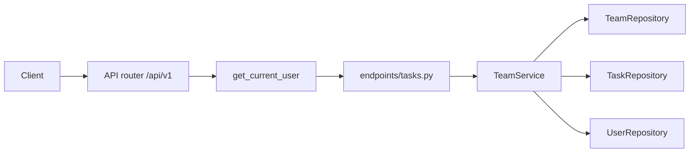
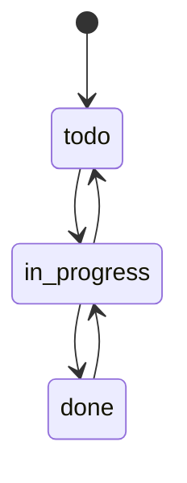

# FastAPI Team Tasks

An intermediate FastAPI service: JWT login from the auth project, plus teams, membership, and a small task board. Users, refresh tokens, teams, and tasks live in memory and reset when the process restarts.

The interesting part is authorization. A signed-in user has a **platform role**. Inside one team they also have a **team role**. Those are different checks, and they live in `TeamService`, not in the route that happens to call it.

Interactive docs: [Swagger UI](/docs) and [ReDoc](/redoc). The OpenAPI page states the status rules. **POST /api/v1/teams** and **POST /api/v1/teams/{team_id}/tasks** include request examples.

## What you get

| Area | Behavior |
|------|----------|
| Auth | Register, login, refresh rotation, logout, `GET /api/v1/auth/me` |
| Platform admin | `admin@example.com` / `AdminPass123!` can list users and every team |
| Teams | Create, read, update, delete. Names are unique, ignoring case |
| Members | Owner adds people by email. Removing someone unassigns their tasks |
| Tasks | Members create and update work. Status changes follow a fixed path |
| Errors | Domain failures return `{"detail": "..."}` with 401, 403, 404, or 409 |
| Docs | Swagger and ReDoc, plus this walkthrough |

## Two roles, on purpose

| | Platform role | Team role |
|--|---------------|-----------|
| Stored on | The user account | One membership row |
| Values | `user`, `admin` | `owner`, `member` |
| How you get it | Register (`user`) or the seed admin | Create a team (owner) or get added (member) |
| What it unlocks | Admin skips membership checks and can list every user | Owner edits the team, the roster, and can delete any task |

`GET /api/v1/teams` shows `team_role`. It is `owner` or `member` when you belong to that team. It is `null` when an admin opens a team they have not joined. That null is the clue that platform admin and team membership are not the same thing.

Route dependencies only prove **who you are** (`get_current_user`). `TeamService` decides **what you may do** with that identity:

- Missing team → `404`
- Signed in, but not on the team → `403` (`You are not a member of this team`)
- On the team, but not the owner → `403` (`Only the team owner can do that`)
- Rule broken, resource exists → `409` (duplicate name, bad status move, assignee not on the team)

A platform admin passes the member and owner checks without joining.

## Project layout

```
app/
  main.py                 # App factory, OpenAPI text, CORS, AppError handler
  core/                   # Settings, JWT + bcrypt, AppError types
  api/deps.py             # Bearer token, current user, repository providers
  api/v1/endpoints/       # auth, users, teams, tasks, health
  schemas/                # Pydantic models, including status and team role
  repositories/           # In-memory users, refresh tokens, teams, tasks
  services/               # Auth rules and team/task rules
tests/
  api/v1/                 # Auth flow and team/task rules
```

### Request flow



1. **HTTP** — FastAPI parses the body and, for task routes, the `team_id` in the path.
2. **Auth dependency** — `get_current_user` checks the access token and loads the account. No token is `401`.
3. **Service** — Loads the team, checks membership or ownership, then applies the status and assignee rules.
4. **Repositories** — Read and write the in-memory stores. They do not decide permissions.

## Task status



New tasks are always `todo`. Sending the status they already have is a no-op. `todo` → `done` is `409` with `Cannot move a task from todo to done`. Reopen finished work by moving `done` → `in_progress` first.

Who can delete a task: the user who created it, the team owner, or a platform admin.

## Setup

From this directory:

```bash
python -m venv .venv
source .venv/bin/activate   # Windows: .venv\Scripts\activate
pip install -e ".[dev]"
cp .env.example .env        # set SECRET_KEY outside local use
```

## Run

```bash
uvicorn app.main:app --reload
```

| URL | Purpose |
|-----|---------|
| http://127.0.0.1:8000 | API root |
| http://127.0.0.1:8000/docs | Swagger UI |
| http://127.0.0.1:8000/redoc | ReDoc |
| http://127.0.0.1:8000/openapi.json | Raw OpenAPI schema |

If port 8000 is taken, start with `--port 8001`.

The process starts with one admin, one team, and one task:

| | Value |
|--|--------|
| Admin | `admin@example.com` / `AdminPass123!` |
| Team | id `1`, name `Platform`, owner is the admin |
| Task | id `1`, title `Write the API guide`, status `todo`, assigned to the admin |

## End-to-end walkthrough

**1. Health**

```bash
curl -s http://127.0.0.1:8000/api/v1/health
```

**2. Register and log in**

Login uses a form body. The field is `username`, and the value is the email.

```bash
curl -s -X POST http://127.0.0.1:8000/api/v1/auth/register \
  -H "Content-Type: application/json" \
  -d '{"email":"you@example.com","password":"SecurePass1!","full_name":"You"}'

curl -s -X POST http://127.0.0.1:8000/api/v1/auth/login \
  -d "username=you@example.com&password=SecurePass1!"
```

Save `access_token`. Send it as `Authorization: Bearer <access_token>` on every team and task call.

**3. Create a team**

```bash
curl -s -X POST http://127.0.0.1:8000/api/v1/teams \
  -H "Authorization: Bearer <access_token>" \
  -H "Content-Type: application/json" \
  -d '{"name":"Design","description":"Interface work"}'
```

You are the owner. `member_count` is `1`. Creating `design` later returns `409` because names ignore case.

**4. Add someone who already has an account**

```bash
curl -s -X POST http://127.0.0.1:8000/api/v1/teams/<team_id>/members \
  -H "Authorization: Bearer <access_token>" \
  -H "Content-Type: application/json" \
  -d '{"email":"admin@example.com"}'
```

Unknown emails are `404`. A member who calls this route gets `403`.

**5. Create a task and move it**

```bash
curl -s -X POST http://127.0.0.1:8000/api/v1/teams/<team_id>/tasks \
  -H "Authorization: Bearer <access_token>" \
  -H "Content-Type: application/json" \
  -d '{"title":"Sketch the board","assignee_email":"you@example.com"}'

curl -s -X PATCH http://127.0.0.1:8000/api/v1/teams/<team_id>/tasks/<task_id> \
  -H "Authorization: Bearer <access_token>" \
  -H "Content-Type: application/json" \
  -d '{"status":"in_progress"}'
```

`assignee_email` must already be on the team. Filter the board with `GET /api/v1/teams/<team_id>/tasks?status=in_progress`.

**6. Look at the seed board as admin**

```bash
curl -s -X POST http://127.0.0.1:8000/api/v1/auth/login \
  -d "username=admin@example.com&password=AdminPass123!"

curl -s http://127.0.0.1:8000/api/v1/teams/1/tasks \
  -H "Authorization: Bearer <admin_access_token>"
```

Admin owns the seed team, so `team_role` there is `owner`. On a team someone else created, admin can still open it and `team_role` is `null`.

### Same flow in Swagger UI

Open http://127.0.0.1:8000/docs. Use **Authorize** with an access token from **POST /api/v1/auth/login** (the password form). Then run the **New team** example under **teams**.

### Tests

```bash
pytest -v
```

Auth tests cover register, refresh rotation, logout, and the admin user list. Team tests cover membership, the status path, assignee rules, and deleting a team.

## API reference

| Method | Path | Who | Description |
|--------|------|-----|-------------|
| GET | `/` | — | Welcome |
| GET | `/api/v1/health` | — | Liveness |
| POST | `/api/v1/auth/register` | — | Create account |
| POST | `/api/v1/auth/login` | — | Form login, returns token pair |
| POST | `/api/v1/auth/refresh` | — | Rotate refresh token |
| POST | `/api/v1/auth/logout` | — | Revoke refresh token |
| GET | `/api/v1/auth/me` | Bearer | Current account |
| GET | `/api/v1/users` | Platform admin | List accounts |
| GET | `/api/v1/users/{id}` | Self or admin | One account |
| GET | `/api/v1/teams` | Bearer | Your teams, or all teams if admin |
| POST | `/api/v1/teams` | Bearer | Create a team; you become owner |
| GET | `/api/v1/teams/{id}` | Member or admin | One team |
| PATCH | `/api/v1/teams/{id}` | Owner or admin | Rename or edit the description |
| DELETE | `/api/v1/teams/{id}` | Owner or admin | Delete the team and its tasks (`204`) |
| GET | `/api/v1/teams/{id}/members` | Member or admin | Roster, including the owner |
| POST | `/api/v1/teams/{id}/members` | Owner or admin | Add an existing user by email |
| DELETE | `/api/v1/teams/{id}/members/{user_id}` | Owner or admin | Remove a member (`204`). Not the owner |
| GET | `/api/v1/teams/{id}/tasks` | Member or admin | List tasks. Query: `status`, `assignee_id` |
| POST | `/api/v1/teams/{id}/tasks` | Member or admin | Create a `todo` |
| GET | `/api/v1/teams/{id}/tasks/{task_id}` | Member or admin | One task |
| PATCH | `/api/v1/teams/{id}/tasks/{task_id}` | Member or admin | Edit fields and move status |
| DELETE | `/api/v1/teams/{id}/tasks/{task_id}` | Creator, owner, or admin | Delete (`204`) |

### Task JSON

**Create**

```json
{
  "title": "Sketch the board",
  "description": "First pass",
  "assignee_email": "you@example.com"
}
```

**Patch** — send only the fields that change. `clear_assignee: true` drops the assignee. Do not send that together with `assignee_email`.

```json
{ "status": "in_progress" }
```

## Where the rules live

| Rule | Code |
|------|------|
| Token required | `app/api/deps.py` — `get_current_user` |
| Member vs owner vs admin | `app/services/team_service.py` — `_require_member`, `_require_owner` |
| Status graph | `_TRANSITIONS` in the same service |
| Assignee must be on the team | `_require_assignee` |
| Unique team name | `TeamRepository.name_taken` |
| Unassign when a member leaves | `remove_member` then `TaskRepository.clear_assignee` |

Read the service before the route files. The routes are thin on purpose: they describe the HTTP contract, and the service is what you change when a rule changes.

## Lint

```bash
ruff check app tests
```

## Docker

```bash
docker build -t fastapi-team-tasks .
docker run --rm -p 8000:8000 -e SECRET_KEY=your-production-secret fastapi-team-tasks
```

## What this store is not

The stores are dictionaries. A restart drops every registration, team, and task except the seed rows created in the repository constructors. The auth notes still apply: use a real `SECRET_KEY`, keep access tokens short, and replace the in-memory refresh-token list before any shared deployment. Team and task rows would move to a database in that same step; the service methods would stay the place that checks membership.
