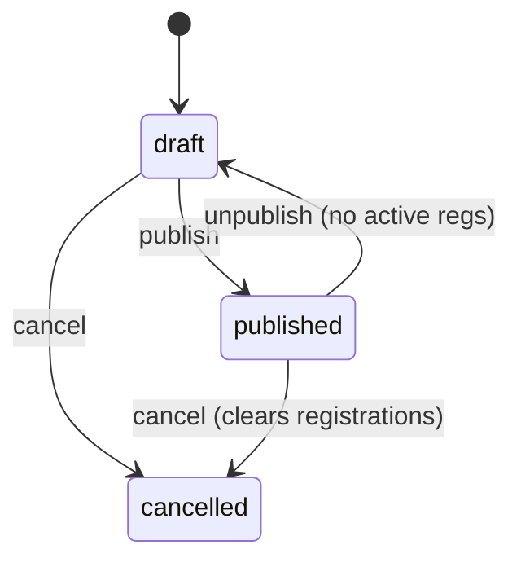
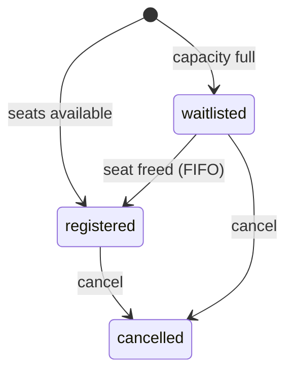
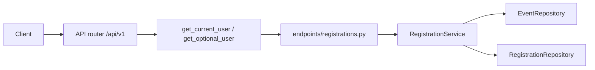

# FastAPI Event Registration

An intermediate FastAPI service: JWT login, admin-managed events, attendee registrations, and a simple waitlist. Users, events, and registrations live in memory and reset when the process restarts.

The interesting part is where rules live. Dependencies prove **who you are**. `EventService` and `RegistrationService` enforce visibility, capacity, and waitlist promotion.

Interactive docs: [Swagger UI](/docs) and [ReDoc](/redoc). **POST /api/v1/registrations** includes a sign-up example.

## What you get

| Area | Behavior |
|------|----------|
| Auth | Register, login, refresh rotation, logout, `GET /api/v1/auth/me` |
| Events | Public list is published-only. Admins create, edit drafts, publish, unpublish, cancel |
| Visibility | Draft and cancelled events return **404** to non-admins |
| Registration | Signed-in users register for published events |
| Capacity | Full events put new sign-ups on the **waitlist** |
| Waitlist | Cancelling a registered seat promotes the oldest waitlisted attendee |
| Privacy | Another user's registration id returns **404**, not **403** |
| Tags | Public tag counts from published events only |
| Errors | Domain failures return `{"detail": "..."}` with 401, 403, 404, or 409 |

## Roles

| | User | Platform admin |
|--|------|----------------|
| List published events | Yes (no token) | Yes; may filter drafts/cancelled |
| View draft event | **404** | Yes |
| Create / edit events | No | Yes (edit drafts only) |
| Publish / unpublish / cancel | No | Yes |
| Register for event | Yes | Yes |
| List registrations | Own rows | All rows; per-event roster |
| Cancel registration | Own row | Any row |

## Event status



## Registration status



## Project layout

```
app/
  main.py                 # App factory, OpenAPI text, CORS, AppError handler
  core/                   # Settings, JWT + bcrypt, AppError types
  api/deps.py             # Bearer token, optional user, repository providers
  api/v1/endpoints/       # auth, users, events, registrations, tags, health
  schemas/                # Pydantic models for events and registrations
  repositories/           # In-memory events and registrations
  services/               # Visibility, capacity, waitlist rules
tests/
  api/v1/                 # Auth, events, registration, waitlist
```

### Request flow



## Setup

```bash
python -m venv .venv
source .venv/bin/activate
pip install -e ".[dev]"
cp .env.example .env
```

## Run

```bash
uvicorn app.main:app --reload
```

| URL | Purpose |
|-----|---------|
| http://127.0.0.1:8000/docs | Swagger UI |
| http://127.0.0.1:8000/redoc | ReDoc |

## Walkthrough

**Browse (no login)**

```bash
curl -s http://127.0.0.1:8000/api/v1/events
curl -s http://127.0.0.1:8000/api/v1/events/fastapi-meetup
```

**Admin login** (seed account)

```bash
TOKEN=$(curl -s -X POST http://127.0.0.1:8000/api/v1/auth/login \
  -d 'username=admin@example.com&password=AdminPass123!' | jq -r .access_token)
```

**Register as a user**

```bash
curl -s -X POST http://127.0.0.1:8000/api/v1/auth/register \
  -H 'Content-Type: application/json' \
  -d '{"email":"you@example.com","password":"SecurePass1!","full_name":"You"}'
USER_TOKEN=$(curl -s -X POST http://127.0.0.1:8000/api/v1/auth/login \
  -d 'username=you@example.com&password=SecurePass1!' | jq -r .access_token)

curl -s -X POST http://127.0.0.1:8000/api/v1/registrations \
  -H "Authorization: Bearer $USER_TOKEN" \
  -H 'Content-Type: application/json' \
  -d '{"event_slug":"fastapi-meetup"}'
```

## Where the rules live

| Rule | Location |
|------|----------|
| Draft/cancelled visibility | `_can_view` in `app/services/event_service.py` |
| Publish / unpublish / cancel | `EventService.transition` |
| Capacity and waitlist | `RegistrationService.register` |
| Waitlist promotion | `RegistrationService._promote_waitlist` |
| Registration privacy | `RegistrationService._can_view` |

## Tests

```bash
pytest -v
ruff check app tests
```

Seed event `fastapi-meetup` has **capacity 2** and the admin already registered — use that in tests for waitlist behavior.

## Configuration

See `.env.example` for `SECRET_KEY`, JWT lifetimes, and CORS.
