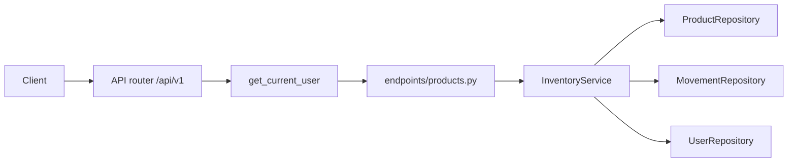

# FastAPI Inventory

An intermediate FastAPI service: JWT login, a product catalog, on-hand quantities, and an append-only movement ledger. Users, refresh tokens, products, and movements live in memory and reset when the process restarts.

The interesting part is where the rules live. Route dependencies only prove **who you are** (`get_current_user`). `InventoryService` decides **what you may do** and whether a stock change is allowed.

Interactive docs: [Swagger UI](/docs) and [ReDoc](/redoc). **POST /api/v1/products** and the receive, sale, and adjust routes include request examples.

## What you get

| Area | Behavior |
|------|----------|
| Auth | Register, login, refresh rotation, logout, `GET /api/v1/auth/me` |
| Catalog | SKUs with name, description, reorder level, active flag |
| Stock | `quantity_on_hand` changes only through movement routes |
| Ledger | Every receive, sale, and adjust appends a row with `quantity_after` |
| Low stock | `is_low_stock` when `quantity_on_hand <= reorder_level` |
| Platform admin | Create and update products, deactivate SKUs, list inactive rows |
| Errors | Domain failures return `{"detail": "..."}` with 401, 403, 404, or 409 |
| Docs | Swagger and ReDoc, plus this walkthrough |

## Two layers of permission

| | Regular user | Platform admin |
|--|--------------|----------------|
| List active products | Yes | Yes |
| Record receive / sale / adjust | Yes, on active SKUs | Yes |
| Create or update catalog fields | No (`403`) | Yes |
| Deactivate or activate a SKU | No | Yes |
| See inactive SKUs in the list | No | Yes, with `include_inactive=true` |
| Open an inactive SKU by path | `404` (looks missing) | Yes |

Inactive products behave like hidden rows for regular users: **404**, not **403**, so the client cannot tell whether the SKU never existed.

Stock movements on inactive products return **409**.

## Project layout

```
app/
  main.py                 # App factory, OpenAPI text, CORS, AppError handler
  core/                   # Settings, JWT + bcrypt, AppError types
  api/deps.py             # Bearer token, repository providers
  api/v1/endpoints/       # auth, users, products, health
  schemas/                # Pydantic models, SKU shape, movement bodies
  repositories/           # In-memory products and movements
  services/               # Auth rules and inventory rules
tests/
  api/v1/                 # Auth flow and stock rules
```

### Request flow



1. **HTTP** — FastAPI parses the body and the `sku` in the path.
2. **Auth dependency** — `get_current_user` checks the access token. No token is **401**.
3. **Service** — Checks admin rules, active flag, and whether the new quantity would go negative.
4. **Repositories** — Read and write stores. They do not decide permissions.

## Movement types

| Route | Body | Effect on hand |
|-------|------|----------------|
| `POST .../receive` | positive `quantity` | Adds units |
| `POST .../sale` | positive `quantity` | Removes units |
| `POST .../adjust` | signed `delta` | Adds or removes units |

`quantity_on_hand` is never patched directly. That keeps the ledger aligned with the number on the product row.

Overselling returns **409** with the on-hand count in the message. An adjust with `delta: 0` is **409**.

Creating a product with starting stock writes an opening **receive** movement.

## Setup

From this directory:

```bash
python -m venv .venv
source .venv/bin/activate   # Windows: .venv\Scripts\activate
pip install -e ".[dev]"
cp .env.example .env        # set SECRET_KEY outside local use
```

## Run

```bash
uvicorn app.main:app --reload
```

| URL | Purpose |
|-----|---------|
| http://127.0.0.1:8000 | API root |
| http://127.0.0.1:8000/docs | Swagger UI |
| http://127.0.0.1:8000/redoc | ReDoc |
| http://127.0.0.1:8000/openapi.json | Raw OpenAPI schema |

## End-to-end walkthrough

**1. Health**

```bash
curl -s http://127.0.0.1:8000/api/v1/health
```

**2. Register and log in**

Login uses a form body. The field is `username`, and the value is the email.

```bash
curl -s -X POST http://127.0.0.1:8000/api/v1/auth/register \
  -H "Content-Type: application/json" \
  -d '{"email":"you@example.com","password":"SecurePass1!","full_name":"You"}'

curl -s -X POST http://127.0.0.1:8000/api/v1/auth/login \
  -d "username=you@example.com&password=SecurePass1!"
```

Save `access_token`. Product routes need `Authorization: Bearer <access_token>`.

**3. List products and low stock**

```bash
curl -s http://127.0.0.1:8000/api/v1/products \
  -H "Authorization: Bearer <access_token>"

curl -s "http://127.0.0.1:8000/api/v1/products?low_stock=true" \
  -H "Authorization: Bearer <access_token>"
```

Seed rows include `GADGET-B` (3 on hand, reorder 10) and `CABLE-C` (0 on hand, reorder 2).

**4. Receive stock on an empty SKU**

```bash
curl -s -X POST http://127.0.0.1:8000/api/v1/products/CABLE-C/receive \
  -H "Authorization: Bearer <access_token>" \
  -H "Content-Type: application/json" \
  -d '{"quantity": 5, "note": "PO-1001"}'
```

**5. Record a sale**

```bash
curl -s -X POST http://127.0.0.1:8000/api/v1/products/GADGET-B/sale \
  -H "Authorization: Bearer <access_token>" \
  -H "Content-Type: application/json" \
  -d '{"quantity": 1, "note": "Order 5501"}'
```

Selling more than is on hand returns **409**.

**6. Read the ledger**

```bash
curl -s "http://127.0.0.1:8000/api/v1/products/CABLE-C/movements?limit=10" \
  -H "Authorization: Bearer <access_token>"
```

Newest movement first. Each row includes `delta`, `quantity_after`, and `actor_name`.

**7. Admin creates a SKU**

```bash
curl -s -X POST http://127.0.0.1:8000/api/v1/auth/login \
  -d "username=admin@example.com&password=AdminPass123!"

curl -s -X POST http://127.0.0.1:8000/api/v1/products \
  -H "Authorization: Bearer <admin_access_token>" \
  -H "Content-Type: application/json" \
  -d '{"sku":"label-d","name":"Label roll","quantity_on_hand":50,"reorder_level":10}'
```

SKU is stored as `LABEL-D`. Duplicate SKUs return **409**.

### Same flow in Swagger UI

Open http://127.0.0.1:8000/docs. **Authorize** with an access token from **POST /api/v1/auth/login**, then run **POST /api/v1/products/CABLE-C/receive** using the shipment example.

### Tests

```bash
pytest -v
ruff check app tests
```

## API reference

| Method | Path | Who | Description |
|--------|------|-----|-------------|
| GET | `/` | — | Welcome |
| GET | `/api/v1/health` | — | Liveness |
| POST | `/api/v1/auth/register` | — | Create account |
| POST | `/api/v1/auth/login` | — | Form login, returns token pair |
| POST | `/api/v1/auth/refresh` | — | Rotate refresh token |
| POST | `/api/v1/auth/logout` | — | Revoke refresh token |
| GET | `/api/v1/auth/me` | Bearer | Current account |
| GET | `/api/v1/users` | Platform admin | List accounts |
| GET | `/api/v1/users/{id}` | Self or admin | One account |
| GET | `/api/v1/products` | Bearer | List products. Query: `low_stock`, `search`, `include_inactive` |
| POST | `/api/v1/products` | Platform admin | Create a product |
| GET | `/api/v1/products/{sku}` | Bearer | One product |
| PATCH | `/api/v1/products/{sku}` | Platform admin | Update name, description, reorder_level |
| POST | `/api/v1/products/{sku}/deactivate` | Platform admin | Hide from default list |
| POST | `/api/v1/products/{sku}/activate` | Platform admin | Return to active catalog |
| GET | `/api/v1/products/{sku}/movements` | Bearer | Movement history. Query: `limit`, `offset` |
| POST | `/api/v1/products/{sku}/receive` | Bearer | Add stock |
| POST | `/api/v1/products/{sku}/sale` | Bearer | Remove stock |
| POST | `/api/v1/products/{sku}/adjust` | Bearer | Signed correction |

### Product JSON

**Create**

```json
{
  "sku": "LABEL-D",
  "name": "Label roll",
  "description": "",
  "quantity_on_hand": 0,
  "reorder_level": 10
}
```

**Read** — includes computed `is_low_stock`.

```json
{
  "id": 2,
  "sku": "GADGET-B",
  "name": "Gadget B",
  "description": "Runs low often in the demo.",
  "quantity_on_hand": 3,
  "reorder_level": 10,
  "is_active": true,
  "is_low_stock": true,
  "updated_at": "2026-03-01T12:00:00+00:00"
}
```

## Where the rules live

| Rule | Code |
|------|------|
| Token required | `app/api/deps.py` — `get_current_user` |
| Admin-only catalog writes | `InventoryService._require_admin` |
| Inactive SKU looks missing | `InventoryService._visible_product` |
| No negative quantity | `InventoryService._apply_delta` |
| Low stock flag | `InventoryService._is_low_stock` |
| Unique SKU | `ProductRepository.sku_taken` |
| Ledger append | `InventoryService._record_movement` |

Read the service before the route files. The routes describe the HTTP contract for Swagger. The service is what you change when a rule changes.

## Docker

```bash
docker build -t fastapi-inventory .
docker run --rm -p 8000:8000 -e SECRET_KEY=your-production-secret fastapi-inventory
```

## What this store is not

The stores are dictionaries. A restart drops every registration and movement except the seed rows. Replace the in-memory refresh-token list and catalog with a database before any shared deployment; the service methods would remain the place that checks stock and permissions.
